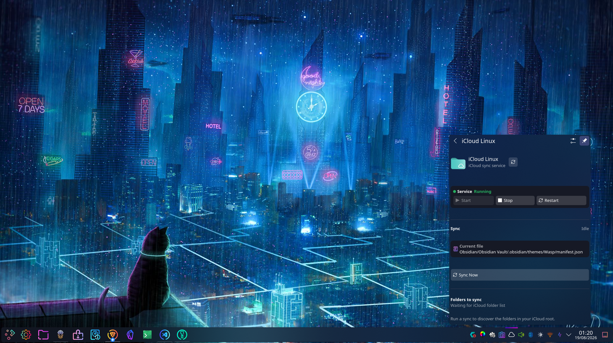
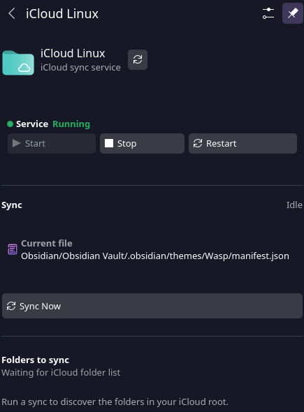

# iCloud Linux Tray UI

A KDE Plasma 6-focused fork of [`icloud-linux`](https://github.com/IsmaeelAkram/icloud-linux) that adds a native Plasma tray interface for controlling and monitoring iCloud Drive on Linux.




## Features

- Mount iCloud Drive as a local-first FUSE filesystem
- KDE Plasma 6 tray integration
- Start / Stop / Restart controls
- Manual **Sync Now**
- Live sync state
- Metadata crawl progress
- Hydration status
- Current-file activity
- Root-level iCloud folder selection
- Automatic `sync_paths` updates from the UI
- Persistent local cache
- Apple ID + 2FA authentication
- User-level systemd services

---

# Installation

## Requirements

### Core

- Linux
- Python 3
- Python `venv`
- FUSE
- systemd user services

### KDE Plasma UI

- KDE Plasma 6
- Qt 6
- Qt 6 QML
- Qt 6 D-Bus
- CMake
- C++17 compiler
- `kpackagetool6`

### CachyOS / Arch Linux

```bash
sudo pacman -S --needed base-devel cmake qt6-base qt6-declarative libplasma
```

### Debian / Ubuntu

```bash
sudo apt-get update
sudo apt-get install -y fuse libfuse-dev pkg-config python3-venv
```

The Plasma UI additionally requires Plasma 6 / Qt 6 development packages.

### Fedora

```bash
sudo dnf install python3-devel fuse fuse-libs fuse-devel gcc make
```

The Plasma UI additionally requires Plasma 6 / Qt 6 development packages.

---

## 1. Clone the repository

```bash
git clone https://github.com/OWAINEDWARDS/icloud-linux-trayUI.git
cd icloud-linux-trayUI
```

Make the setup scripts executable:

```bash
chmod +x icloudctl setup-user.sh finish-setup.sh
```

---

## 2. Initial setup

```bash
./setup-user.sh
```

This:

- creates the Python virtual environment
- installs Python dependencies
- creates the configuration directories
- creates the iCloud systemd user service
- creates the mount directory
- enables `icloud.service`

The default mount is:

```text
~/iCloud
```

Configuration is stored under:

```text
~/.config/icloud-linux/
```

---

## 3. Finish setup

Run this from a normal KDE desktop terminal so the user D-Bus session is available:

```bash
./finish-setup.sh
```

The script guides you through:

1. Apple ID configuration
2. Apple 2FA authentication
3. KDE Plasma UI installation
4. starting the iCloud service
5. checking the Plasma backend

The native QML plugin is installed to:

```text
/usr/lib/qt6/qml/org/icloudlinux/backend/
```

The Plasma widget is installed to:

```text
~/.local/share/plasma/plasmoids/org.icloudlinux.plasma/
```

The UI backend runs as:

```text
icloud-linux-ui.service
```

---

## 4. Add the Plasma widget

If the widget is not already visible:

1. Right-click the Plasma panel.
2. Select **Add Widgets**.
3. Search for **iCloud Linux**.
4. Add it to the panel or System Tray.

Plasma remembers the widget placement between sessions.

---

# Using the Plasma UI

The tray popup provides:

## Service controls

```text
Start
Stop
Restart
```

These control `icloud.service`.

## Manual sync

Press:

```text
Sync Now
```

The command-line equivalent is:

```bash
./icloudctl sync
```

## Live status

During sync, the UI can display:

```text
Starting...
Scanning iCloud... 79 folders scanned
Hydrating...
Syncing...
Idle
```

When file-level activity is available, the current iCloud path is also shown.

## Folder selection

After iCloud's root metadata has been discovered, the UI lists root-level folders such as:

```text
Documents
Downloads
Obsidian
Photos
Work
```

Select the folders you want and press:

```text
Save & Apply
```

The selection is written to:

```text
~/.config/icloud-linux/config.yaml
```

Example:

```yaml
sync_paths:
  - /Documents
  - /Obsidian
  - /Work
```

Only real root-level iCloud folders are accepted.

At least one folder must remain selected.

If all root folders are selected, the configuration may use:

```yaml
sync_paths: null
```

which means all paths are allowed.

---

# How It Works

The Plasma integration uses:

```text
KDE Plasma QML
      ↓
C++ BackendBridge
      ↓
D-Bus
      ↓
Python BackendService
      ↓
icloudctl / systemd / icloud-linux
```

The backend uses:

```text
D-Bus service:   org.iCloudLinux
Object:          /Backend
Interface:       org.iCloudLinux.Backend
```

The Python backend is split into:

```text
BackendService
├── ServiceManager
├── SyncManager
├── LogFeeder
└── ConfigManager
```

---

# Sync Behaviour

## Metadata crawl

The service scans iCloud Drive and refreshes the local metadata index.

The UI reports progress such as:

```text
Scanning iCloud... 79 folders scanned
```

## Hydration

Hydration downloads file contents into the persistent local mirror.

Depending on configuration, files can hydrate:

- on demand
- in the background
- explicitly with `icloudctl hydrate`

## `sync_paths`

`sync_paths` is an allow-list for hydration.

Example:

```yaml
sync_paths:
  - /Downloads
```

## `exclude_paths`

`exclude_paths` is a deny-list and takes priority over `sync_paths`.

Example:

```yaml
sync_paths:
  - /Downloads

exclude_paths:
  - /Downloads/Large Archive
```

---

# Useful Commands

## Main service

```bash
./icloudctl start
./icloudctl stop
./icloudctl restart
./icloudctl refresh
./icloudctl status
./icloudctl logs
```

## Sync

```bash
./icloudctl sync
./icloudctl hydrate
./icloudctl hydrate --dry-run
./icloudctl clear-cache
```

## Plasma UI

```bash
./icloudctl install-ui
./icloudctl ui-status
./icloudctl ui-logs
```

## Diagnostics

```bash
./icloudctl doctor
```

---

# Logs

## Main service

```bash
./icloudctl logs
```

or:

```bash
journalctl --user -u icloud.service -f
```

## Plasma backend

```bash
./icloudctl ui-logs
```

or:

```bash
journalctl --user -u icloud-linux-ui.service -f
```

## Raw iCloud log

```bash
tail -f ~/.local/state/icloud-linux/icloud.log
```

Show only new sync-related events:

```bash
tail -n 0 -f ~/.local/state/icloud-linux/icloud.log | grep --line-buffered -E "Remote metadata crawl|hydrate-start|hydrate-complete|file-sync-start|download-complete"
```

---

# Authentication

Authenticate with:

```bash
./icloudctl auth
```

If the saved Apple session expires:

```bash
./icloudctl auth
./icloudctl restart
```

For the iOS 26 beta SMS workaround:

```bash
./icloudctl auth --force-sms
```

For authentication diagnostics:

```bash
./icloudctl auth --debug
```

---

# Local Files and State

```text
Config:
~/.config/icloud-linux/config.yaml

Session cookies:
~/.config/icloud-linux/cookies

Service environment:
~/.config/icloud-linux/icloud.env

Main service:
~/.config/systemd/user/icloud.service

UI backend service:
~/.config/systemd/user/icloud-linux-ui.service

Local cache:
~/.cache/icloud-linux

Local mirror:
~/.cache/icloud-linux/mirror

Sync database:
~/.cache/icloud-linux/state.sqlite3

Application log:
~/.local/state/icloud-linux/icloud.log
```

---

# Updating

Pull the latest version:

```bash
git pull
```

Update the Plasma integration:

```bash
./icloudctl install-ui
```

If Plasma still has an older native plugin loaded:

```bash
systemctl --user restart plasma-plasmashell.service
```

---

# Development

The KDE frontend is organised as:

```text
ui_backend/
├── backend_service.py
├── config_manager.py
├── gui_log_feeder.py
├── service_manager.py
└── sync_manager.py

plasma_plugin/
├── backend_bridge.cpp
├── backend_bridge.h
├── icloudlinux_plugin.cpp
├── icloudlinux_plugin.h
└── qmldir

plasmoid/
├── metadata.json
└── contents/ui/main.qml
```

## Python backend changes

```bash
systemctl --user restart icloud-linux-ui.service
```

## C++ bridge changes

```bash
cmake --build build
sudo cmake --install build
systemctl --user restart plasma-plasmashell.service
```

## QML-only changes

```bash
rm -rf ~/.local/share/plasma/plasmoids/org.icloudlinux.plasma
cp -a plasmoid ~/.local/share/plasma/plasmoids/org.icloudlinux.plasma
systemctl --user restart plasma-plasmashell.service
```

---

# Troubleshooting

## Main service

```bash
./icloudctl status
./icloudctl doctor
./icloudctl logs
```

## Plasma backend

```bash
systemctl --user status icloud-linux-ui.service --no-pager -l
```

## Check D-Bus

```bash
busctl --user list | grep iCloudLinux
```

Test the backend:

```bash
busctl --user call org.iCloudLinux /Backend org.iCloudLinux.Backend Ping
```

Expected:

```text
s "pong"
```

Inspect the interface:

```bash
busctl --user introspect org.iCloudLinux /Backend org.iCloudLinux.Backend
```

The live state signal should be:

```text
.state_changed   signal   sbss
```

Watch live signals:

```bash
busctl --user --match="type='signal',path='/Backend',interface='org.iCloudLinux.Backend'" monitor
```

## Plasma widget fails to load

```bash
journalctl --user -u plasma-plasmashell.service -f
```

Check the native QML module:

```bash
ls -l /usr/lib/qt6/qml/org/icloudlinux/backend/
```

Expected:

```text
libicloudlinuxplugin.so
qmldir
```

---

# To-Do List

* [x] Basic GUI Tray integration with KDE Plasma.
* [ ] After meta-data crawl - halt - gui select fodler - update config file - sync only based on selection from root folder.
* [ ] Documentation of code.
* [ ] Update Read-me for UI integration with kde.
* [ ] Add Ui Image to read-me
* [ ] Add Uninstall

## Bugs

* [ ] sync pre button click (non manual) doesnt update UI loading bar + says idle.

## Planned UI Features

* [ ] Recursive folder selection.

## Notes

Integrated iCloudLinux with KDE plasma using kde plasmoids.

---

# Credits

This repository is based on:

[`IsmaeelAkram/icloud-linux`](https://github.com/IsmaeelAkram/icloud-linux)

KDE Plasma integration and the additional frontend/backend work in this fork are maintained at:

[`OWAINEDWARDS/icloud-linux-trayUI`](https://github.com/OWAINEDWARDS/icloud-linux-trayUI)
